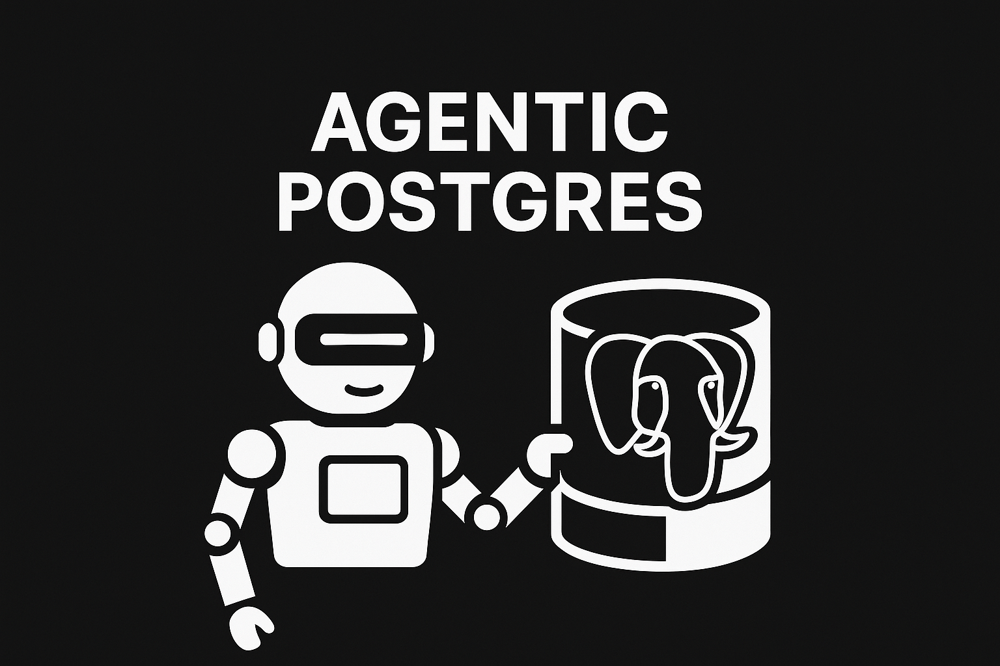

# Agentic Postgres

**The first PostgreSQL database purpose-built for AI agents.**

<p align="center">
  
</p>

Agentic Postgres combines **MCP integration**, **vector embeddings**, **hybrid search**, **time-series analytics**, and **observability** in a single, intelligent platform.

> One database. All capabilities. Zero complexity.

---

## Why Agentic Postgres?

Users want experiences like ChatGPT. They expect apps to intelligently figure out what tools are needed, think through problems step by step, and adapt to their questions in real time.

When an end user asks **"Why did sales drop last month?"** or **"Are customers complaining about our new feature?"**, that simple question triggers dozens of sophisticated database operations:

- **→ Multiple SQL queries** for structured data analysis
- **→ Time-series queries** to identify trends and anomalies over time
- **→ Keyword search** to find exact mentions and phrases
- **→ Semantic search** to understand meaning and sentiment
- **→ Hybrid search** combining multiple techniques for maximum recall
- **→ Memory updates** to store insights and maintain context

To support this, Postgres needs **all of these capabilities built in**. MCP for intelligent interactions. Vector embeddings for semantic search. BM25 for keyword search. Hybrid search combining both. Time-series analytics. All working together, at scale, faster than stitching together multiple specialized databases.

**That's Agentic Postgres.**

---

## Replace Your Entire Stack

From five separate databases to one intelligent system:

### Before: Traditional Stack
```
PostgreSQL + InfluxDB + Elasticsearch + Pinecone + OpenAI API
```
Five services • Data synchronization • Higher costs • Operational complexity

### After: Agentic Postgres
```
Agentic Postgres
```
One database • Zero data movement • Simplified operations • Lower total cost

**What gets replaced:**
- ❌ **Pinecone** (vector search) → ✅ **pgvectorscale**
- ❌ **Elasticsearch** (full-text) → ✅ **PostgreSQL FTS (BM25)**
- ❌ **InfluxDB** (time-series) → ✅ **TimescaleDB**
- ❌ **Separate embedding service** → ✅ **pgai**
- ❌ **Application-layer logic** → ✅ **plpgsql**

---

## The Tech Stack

Six powerful extensions working together as one:

| Extension | Type | Purpose | Replaces |
|-----------|------|---------|----------|
| **timescaledb** | time-series | Hypertables, time-series functions | InfluxDB, Prometheus |
| **vector** | ai | Vector data type, basic ops | Foundation layer |
| **vectorscale** | ai | DiskANN index for fast similarity | Pinecone, Weaviate |
| **ai (pgai)** | ai | Generate embeddings in DB | Separate embedding service |
| **pg_textsearch** | Built-in | BM25 keyword search | Elasticsearch, Algolia |
| **plpgsql** | Built-in | Procedural language for logic | Application-layer logic |

---

## See It In Action

Watch how an agent investigates a business problem using plain English queries. Each question builds on the last, showcasing different capabilities.

### 1. "Why did sales drop?"
**Capability:** TimescaleDB + Multi-Query Analysis

```sql
SELECT product_name, 
       SUM(CASE WHEN order_date = CURRENT_DATE - 1 THEN amount ELSE 0 END) AS yesterday_sales,
       SUM(CASE WHEN order_date = CURRENT_DATE - 8 THEN amount ELSE 0 END) AS last_week_sales
FROM orders
GROUP BY product_name
ORDER BY change_amount;
```

**Agent discovers:** Premium Wireless Headphones dropped from $3,299.89 → $0

---

### 2. "What are customers saying?"
**Capability:** Hybrid Search (BM25 + Vector + RRF)

```sql
WITH semantic_search AS (
  -- Vector similarity using pgvectorscale
  SELECT id, feedback_text, sentiment,
         1 - (embedding <=> query_vector) as similarity,
         ROW_NUMBER() OVER (ORDER BY embedding <=> query_vector) as rank
  FROM user_feedback WHERE embedding IS NOT NULL
),
fulltext_search AS (
  -- BM25 keyword search using PostgreSQL FTS
  SELECT id, ts_rank(...) as fts_rank,
         ROW_NUMBER() OVER (ORDER BY ts_rank(...) DESC) as rank
  FROM user_feedback
  WHERE to_tsvector(feedback_text) @@ websearch_to_tsquery(keywords)
),
combined AS (
  -- RRF: Combine rankings with 1/(rank+60) formula
  SELECT *, (1.0/(s.rank+60) + 1.0/(f.rank+60)) as rrf_score
  FROM semantic_search s FULL OUTER JOIN fulltext_search f USING (id)
)
SELECT * FROM combined ORDER BY rrf_score DESC LIMIT 15;
```

**Agent finds:** 15 customer complaints about defects (cushions falling apart, static noise, poor materials)

---

### 3. "Are other products affected?"
**Capability:** Semantic Search (pgvectorscale)

**Agent analyzes:** Semantically similar feedback across all products to identify patterns

---

### 4. "Which customers are at risk?"
**Capability:** SQL Joins + Customer Analysis

**Agent identifies:** 27 customers who bought the product and left negative feedback

---

### 5. "What should I do immediately?"
**Capability:** Agent Memory (RAG) + Cross-Query Synthesis

**Agent recalls:** All findings from previous investigations and synthesizes actionable recommendations

---

### 6. "How did you figure this out?"
**Capability:** Self-Observability

**Agent reveals:** Step-by-step investigation process, tools used, duration - querying its own history!

---

## Quick Start

### Get Started in 3 Commands

```bash
# Install Tiger CLI
curl -fsSL https://cli.tigerdata.com | sh

# Authenticate
tiger auth login

# Install MCP
tiger mcp install
```

### Run the Demo

```bash
# Clone and install
git clone https://github.com/promarsal/agentic-postgres-demo.git
cd agentic-postgres-demo
npm install

# Configure
echo "OPENAI_API_KEY=sk-..." > .env
echo "DATABASE_URL=postgresql://..." >> .env  # Get from: tiger mcp install output

# Setup database and populate data
npm run build && npm run setup
npm run populate-embeddings
```

**👉 See [`QUICKSTART.md`](QUICKSTART.md) for detailed 5-minute setup guide.**

---

## Try the Investigation

Run these 6 questions to see all capabilities in action:

```bash
# Q1: SQL Analytics + TimescaleDB
npm run dev "Sales dropped yesterday compared to last week - why?"

# Q2: Hybrid Search (BM25 + Vector + RRF) 🌟
npm run dev "What are customers saying about Premium Wireless Headphones?"

# Q3: Semantic Search (pgvectorscale)
npm run dev "Are other products showing similar quality issues?"

# Q4: SQL Joins + Customer Analysis
npm run dev "Which customers bought Premium Wireless Headphones and left negative feedback?"

# Q5: Agent Memory (RAG)
npm run dev "Based on what we've learned, what should I do immediately?"

# Q6: Self-Observability
npm run dev "Show me how you figured this out - what was your investigation process?"
```

**Each question takes 10-30 seconds** and demonstrates different Agentic Postgres capabilities.

---

## What You'll See

Beautiful, readable output showing the agent's investigation process:

```
━━━━━━━━━━━━━━━━━━━━━━━━━━━━━━━━━━━━━━━━━━━━━━━━━━━━━━━━━━━━━━━━
📊 STEP 1: SQL Query
━━━━━━━━━━━━━━━━━━━━━━━━━━━━━━━━━━━━━━━━━━━━━━━━━━━━━━━━━━━━━━━━

💡 Reason: To identify which products experienced a sales drop...

📝 SQL:
──────────────────────────────────────────────────────────────
  SELECT product_name, 
         SUM(CASE WHEN order_date = CURRENT_DATE - 1 THEN amount ELSE 0 END)...
──────────────────────────────────────────────────────────────

✅ Result: 5 rows returned

📊 Results:
   1. Premium Wireless Headphones | 0 | 3299.89 | -3299.89
   2. Smart Fitness Watch | 0 | 749.97 | -749.97
   ...

━━━━━━━━━━━━━━━━━━━━━━━━━━━━━━━━━━━━━━━━━━━━━━━━━━━━━━━━━━━━━━━━
🔍 STEP 2: Hybrid Search (BM25 + Vector)
━━━━━━━━━━━━━━━━━━━━━━━━━━━━━━━━━━━━━━━━━━━━━━━━━━━━━━━━━━━━━━━━

💡 Reason: To find customer feedback related to quality issues...

🔍 Semantic Query: complaints about Premium Wireless Headphones
🔑 Keywords: broken|defective|damaged|poor quality|static noise

📝 SQL: Hybrid Search with Reciprocal Rank Fusion (RRF)
──────────────────────────────────────────────────────────────
  WITH semantic_search AS (
    -- Vector similarity using pgvectorscale
    ...
  ),
  fulltext_search AS (
    -- BM25 keyword search using PostgreSQL FTS
    ...
  )
  SELECT * FROM combined ORDER BY rrf_score DESC LIMIT 15;
──────────────────────────────────────────────────────────────

✅ Found: 15 results

📊 Match Breakdown:
   • Both (BM25 + Vector): 15
   • Semantic only: 0
   • Keyword only: 0

💬 Sample Feedback:
   1. "Defective Premium Wireless Headphones. Cushions fell apart..." [negative]
   ...

━━━━━━━━━━━━━━━━━━━━━━━━━━━━━━━━━━━━━━━━━━━━━━━━━━━━━━━━━━━━━━━━
🧠 Agent Thinking
━━━━━━━━━━━━━━━━━━━━━━━━━━━━━━━━━━━━━━━━━━━━━━━━━━━━━━━━━━━━━━━━

Premium Wireless Headphones: Sales dropped from $3,299.89 to $0.
Root cause: Quality issues reported by customers...

══════════════════════════════════════════════════════════════════════
✅  INVESTIGATION COMPLETE
══════════════════════════════════════════════════════════════════════

Premium Wireless Headphones: Sales dropped from $3,299.89 to $0. 
Root cause: Quality issues reported by customers...
```

**Notice:** The agent shows every SQL query, search technique, and reasoning step!

---

## The Magic: It's Just Postgres

🎯 Everything you just saw happened in **ONE Postgres database**:

- ✅ Time-series queries (TimescaleDB)
- ✅ Semantic search (pgvectorscale + pgai)
- ✅ Full-text search (pg_textsearch BM25)
- ✅ Hybrid search (combining both)
- ✅ Memory & synthesis (stored with embeddings)
- ✅ Self-analysis (querying own history)

**No external services. No data movement. Just intelligent Postgres.**

---

## How It Works

```
CLI → AI SDK Agent → Tools → Agentic Postgres
```

**Stack:**
- **Vercel AI SDK** - Agent reasoning & tool calling (gpt-4o)
- **Agentic Postgres** - PostgreSQL with extensions:
  - **TimescaleDB** - Time-series for agent_events hypertable
  - **pgvector** - Vector storage for embeddings
  - **pgvectorscale** - DiskANN index for fast similarity search
  - **pgai** - Generate embeddings in-database
  - **pg_textsearch** - Built-in BM25 full-text search
  - **plpgsql** - Procedural logic in the database

**Agent Tools:**
- `query_database` - Execute SQL queries
- `hybrid_search` - Combine FTS + vector search (RRF)
- `semantic_search_feedback` - Pure vector similarity
- `fulltext_search` - PostgreSQL FTS
- `store_insight` - Save learnings to agent_memory
- `search_insights` - Recall past learnings (RAG)
- `analyze_agent_performance` - Meta-analysis

---

## What Gets Set Up

`npm run setup` creates everything you need:

- ✅ **Extensions**: timescaledb, vector, vectorscale, ai
- ✅ **Tables**: 6 tables (products, orders, feedback, agent tracking)
- ✅ **Indexes**: DiskANN (vector), GIN/FTS (text), TimescaleDB (time-series)
- ✅ **Demo Data**: 5 products, 71 orders, 88 feedback entries

<details>
<summary>📋 <b>Click for detailed breakdown</b></summary>

### Extensions
- `timescaledb` - Time-series optimization
- `vector` - Vector storage (pgvector)
- `vectorscale` - DiskANN indexes (pgvectorscale)
- `ai` - Generate embeddings in-database (pgai)

### Tables
- `agent_questions` - Investigation tracking
- `agent_events` - Time-series log (TimescaleDB hypertable)
- `agent_memory` - Stored insights with embeddings
- `products`, `orders`, `user_feedback` - Demo business data

### Indexes
- **DiskANN**: Fast vector similarity search (pgvectorscale)
- **GIN/FTS**: PostgreSQL full-text search (BM25)
- **TimescaleDB**: Automatic time-series partitioning
- **B-tree**: Standard indexes on dates/IDs

### Demo Data
- 5 products with realistic pricing
- 71 orders over 14-day period (with intentional sales drop)
- 88 customer feedback entries (27 complaints about quality)

👉 See [`INDEXES_AND_DATA.md`](INDEXES_AND_DATA.md) for complete technical details.
</details>

---

## Key Concepts

<details>
<summary><b>🎯 Hybrid Search (RRF)</b> - The hero capability</summary>

Combines PostgreSQL FTS (keyword) with pgvectorscale (semantic):
- **Full-Text Search**: GIN index, BM25 ranking
- **Vector Search**: DiskANN index, fast ANN search
- **RRF Algorithm**: Reciprocal Rank Fusion merges both for comprehensive results
- **Why powerful**: Catches BOTH exact keywords AND semantically similar concepts
- Replaces Elasticsearch + Pinecone with one query!

Example: Query "quality issues" finds both:
- Exact matches: "quality control problems"
- Semantic matches: "disappointed with purchase", "broke after two days"
</details>

<details>
<summary><b>🧠 Agent Memory (RAG)</b> - Learning across sessions</summary>

Agent stores insights in `agent_memory` with embeddings:
- Semantic search recalls past learnings
- DiskANN enables fast similarity search
- No separate vector database needed
- Builds knowledge over time
</details>

<details>
<summary><b>📊 Observability</b> - Full audit trail</summary>

Every action tracked in `agent_events` (TimescaleDB hypertable):
- Step-by-step investigation tracking
- Performance metrics (duration, tool usage)
- Question tracking with final answers
- Self-analysis capability
</details>

<details>
<summary><b>⏱️ TimescaleDB</b> - Time-series at scale</summary>

Automatic partitioning for time-series data:
- `agent_events` is a hypertable (partitioned by time)
- Efficient queries on time ranges
- Built-in time-series functions
- Compression and retention policies
</details>

👉 **Technical details**: See [`INDEXES_AND_DATA.md`](INDEXES_AND_DATA.md) for SQL code, index specs, and performance metrics.

---

## Documentation

| Guide | Purpose | Time |
|-------|---------|------|
| **[QUICKSTART.md](QUICKSTART.md)** | Get running in 5 minutes | ⚡ 5 min |
| **[TEST_COMMANDS.md](TEST_COMMANDS.md)** | Copy-paste test commands | 🧪 Copy-paste |
| **[GETTING_STARTED.md](GETTING_STARTED.md)** | Complete beginner guide | 📖 10 min |
| **[DEMO_QUERIES.md](DEMO_QUERIES.md)** | Demo script with talking points | 🎤 Reference |
| **[INDEXES_AND_DATA.md](INDEXES_AND_DATA.md)** | Technical deep-dive (SQL, indexes, data) | 🔧 Technical |

---

## Learn More

- **[Agentic Postgres](https://www.agenticpostgres.org/)** - Learn about Agentic Postgres
- **[TigerData](https://www.tigerdata.cloud)** - Managed Agentic Postgres
- **[pgvectorscale](https://github.com/timescale/pgvectorscale)** - DiskANN for PostgreSQL
- **[TimescaleDB](https://www.timescale.com)** - Time-series PostgreSQL
- **[Vercel AI SDK](https://sdk.vercel.ai)** - AI agent framework

---

## License

MIT

---

**Questions?** Check [QUICKSTART.md](QUICKSTART.md) or [GETTING_STARTED.md](GETTING_STARTED.md)  
**Presenting?** See [DEMO_QUERIES.md](DEMO_QUERIES.md) for talking points  
**Technical?** See [INDEXES_AND_DATA.md](INDEXES_AND_DATA.md) for deep dive
